# AURA Tech - Premium Online Shop & Operations Architecture

Welcome to **AURA Tech**, a state-of-the-art e-commerce online shop featuring a sleek Glassmorphism / Cyberpunk dark theme. This project is structured specifically to demonstrate professional DevOps practices, containerization, and a automated **2-Machine Development & Operations Pipeline** as described in your architectural diagram.

---

## 🏗️ Architectural Overview

```mermaid
graph TD
    subgraph DevPart [Development Part - Machine 1]
        VSCode["Visual Studio Code"]
        DockerDev["Docker Compose<br>(Port 1111)"]
        VolumeMount["Live Bind Volume<br>(Instant Hot-Reload)"]
        VSCode --> VolumeMount
        VolumeMount --> DockerDev
    end

    subgraph GithubPart [Store & Version Control]
        GitHub["GitHub Repository"]
        Actions["GitHub Actions<br>(CI/CD Build & Push)"]
        VSCode -- "Push Commit" --> GitHub
        GitHub --> Actions
    end

    subgraph OpsPart [Operation Part - Machine 2]
        NginxServer["Docker Nginx Web Server<br>(Port 1111)"]
        Actions -- "SSH Deployment Trigger" --> NginxServer
    end

    subgraph ClientDevices [Client Browsing]
        ClientDev["Client Device (Browser)"]
        ClientOps["Client Device (Operations View)"]
        ClientDev -- "Local LAN IP: http://<dev-ip>:1111" --> DockerDev
        ClientOps -- "Production IP: http://<ops-ip>:1111" --> NginxServer
    end

    style DevPart fill:#0d0f1e,stroke:#00f5ff,stroke-width:2px;
    style OpsPart fill:#0d0f1e,stroke:#bd00ff,stroke-width:2px;
    style GithubPart fill:#1a112c,stroke:#ff5e00,stroke-width:2px;
```



---

## 💻 Machine 1: Development Setup (Coding)

Machine 1 is your local programming workstation. We use **Docker Compose Bind-Mounting** to allow instant hot-reloading: as soon as you save code in VS Code, Nginx serves it immediately in the browser.

### 1. Prerequisites
Ensure you have the following installed on Machine 1:
* [Visual Studio Code](https://code.visualstudio.com/)
* [Docker Desktop](https://www.docker.com/products/docker-desktop/)
* [Git](https://git-scm.com/)

### 2. Launch Local Development
Open your terminal on Machine 1 and run:
```bash
# Clone the repository (replace with your repo URL)
git clone https://github.com/YOUR_USERNAME/real-time-project.git
cd real-time-project

# Spin up Nginx in the background with local volumes mounted
docker compose up -d
```
* **Verify**: Open your browser and navigate to `http://localhost:1111`. You will see the premium AURA Tech store!
* **How Live Updates Work**: Open `index.html` or `style.css` in VS Code. Make a change (e.g., change the store title or background glow) and save the file. **Refresh your browser—the changes are visible instantly without rebuilding the Docker container!** This is achieved by our dynamic volume mapping:
  ```yaml
  volumes:
    - .:/usr/share/nginx/html
  ```

---

## 📱 Real-Time Updates Testing (2-Machine Local LAN Setup)

If you want **Machine 2** (or a tablet/phone) to see your code changes in **real-time as you write code** on Machine 1 without pushing to GitHub, use your local wireless network (LAN):

1. **Find Machine 1's IP Address**:
   * **macOS / Linux**: Open Terminal and run: `ipconfig getifaddr en0` or `hostname -I`
   * **Windows**: Open Command Prompt and run: `ipconfig` (look for `IPv4 Address` under your active Wi-Fi adapter).
   * *Example IP*: `192.168.1.150`
2. **Access from Machine 2**:
   * Ensure Machine 1 and Machine 2 are connected to the same Wi-Fi router.
   * Open the browser on Machine 2.
   * Enter: `http://192.168.1.150:1111` (replace with Machine 1's actual IP).
   * **Result**: Machine 2 now renders the app served by Machine 1. As you save code on Machine 1, Machine 2 can see the updates instantly with a simple browser refresh!

---

## ⚙️ Machine 2: Operations Setup (Hosting)

Machine 2 runs your production Nginx hosting environment. It does not contain code files locally; instead, it runs an independent, high-performance Docker container built and deployed automatically via the CI/CD pipeline.

### Manual Operations Launch (Optional)
If you wish to spin up the container on Machine 2 manually:
```bash
# Build the production-ready Docker image
docker build -t aura-shop:latest .

# Run the container exposing it to clients
docker run -d --name aura-shop-web -p 1111:80 --restart always aura-shop:latest
```

---

## 🚀 Automated CI/CD Pipeline (GitHub Actions)

We have created a professional pipeline in `.github/workflows/deploy.yml` that performs code validation, builds the Docker image, pushes it to the **GitHub Container Registry (GHCR)**, and triggers deployment on Machine 2.

### How the Pipeline Works:
1. **Push**: You write code in VS Code on Machine 1 and run `git push origin main`.
2. **Validate**: GitHub Actions triggers, validating code syntax to prevent broken deploys.
3. **Build & Tag**: GitHub spins up a runner, logs in to `ghcr.io`, compiles the lightweight `nginx:alpine` Docker image, and tags it with your unique commit hash and `latest`.
4. **Publish**: The image is securely published to GitHub Packages.
5. **Deploy**: GitHub Actions logs in to Machine 2 via SSH, pulls the newly compiled image from `ghcr.io`, stops the old container, and starts the fresh one instantly!

### 🔑 Setting Up Deployment Credentials (GitHub Secrets)

To enable the automated remote deployment step, configure these secrets in your GitHub repository:

1. On GitHub, navigate to: **Settings** -> **Secrets and variables** -> **Actions**.
2. Click **New repository secret** and add the following:
   * `DEPLOY_SERVER_IP`: The public IP or DNS address of Machine 2.
   * `DEPLOY_SERVER_USER`: The SSH username of Machine 2 (e.g., `ubuntu`, `debian`, etc.).
   * `DEPLOY_SSH_KEY`: The private SSH key used to access Machine 2. Generate a key pair using:
     ```bash
     ssh-keygen -t rsa -b 4096 -C "cicd@auratech"
     ```
     Copy the **private key** to this secret, and add the **public key** to the `~/.ssh/authorized_keys` file on Machine 2.

*Note: If these secrets are not configured, the pipeline will still successfully perform all code quality checks, build the Docker container, and publish it to GitHub Packages, allowing you to manually run `docker pull` on Machine 2.*

---

## 📦 File Structure

* `index.html` - The core frontend interface with glassmorphic sections and responsive overlays.
* `style.css` - Custom styling tokens, neon gradients, glass borders, and sliding animations.
* `app.js` - Dynamic state manager, shopping cart computations, catalog filters, and modals.
* `images/keyboard.png` - Stunning premium keyboard showcase asset.
* `Dockerfile` - Builds the optimized lightweight Nginx production container.
* `docker-compose.yml` - Manages development local port mappings and live folder synchronization.
* `nginx.conf` - High-performance server settings, cache-control, and gzip settings.
* `.github/workflows/deploy.yml` - CI/CD pipeline automation file.
